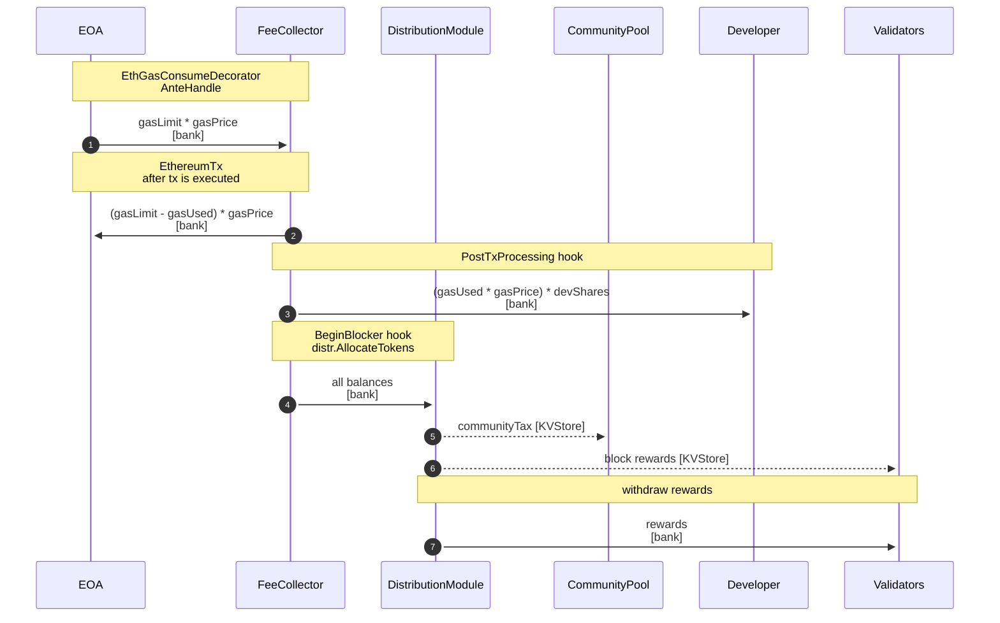

# Evmos and Rewarding Developers from Transaction Fees

Presentation: https://docs.google.com/presentation/d/1BgfFb7iloUE2y-BdVcRexM-5HQ5y2CtWQT4h1DNJ3n4/edit?usp=sharing
Analysis of how transaction fees can be used.
https://www.youtube.com/watch?v=XMlNtI-5ZPQ

### Fees Flow

Code references: https://github.com/tharsis/evmos/issues/437#issuecomment-1083326097

### Address Derivation

```mermaid
sequenceDiagram
    autonumber
    participant EOA1
    participant EOA2
    participant Factory1
    participant Factory2
    participant Contract1
    participant Contract2

    EOA1->>+Factory1: CREATE() <br> nonce=4

    rect rgb(90, 90, 90)
    Note over EOA2: signs & pays for tx
    EOA2-->Factory1: call
    Factory1->>+Factory2: CREATE() <br> nonce=0
    end

    rect rgb(90, 90, 90)
    Note over EOA2: signs & pays for tx
    EOA2-->Factory2: call
    Factory2->>+Contract1: CREATE() <br> nonce=0
    end
    
    rect rgb(90, 90, 90)
    Note over EOA2: signs & pays for tx
    EOA2-->Factory2: call
    Factory2->>+Contract2: CREATE() <br> nonce=1
    end

```

