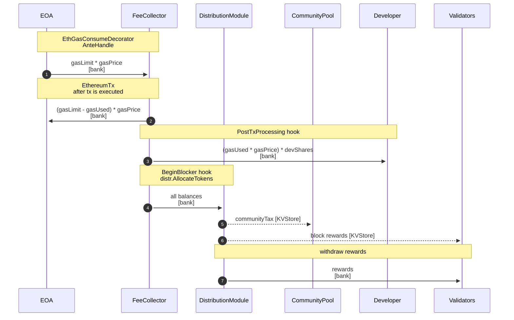

# Evmos and Rewarding Developers from Transaction Fees

```mermaid
sequenceDiagram
    autonumber
    participant EOA
    participant FeeCollector
    participant DistributionModule
    participant CommunityPool
    participant Developer
    participant Validators

    Note over EOA,FeeCollector: EthGasConsumeDecorator<br>AnteHandle
    EOA->>+FeeCollector: gasLimit * gasPrice<br>[bank]
    
    Note over EOA,FeeCollector: EthereumTx<br>after tx is executed
    FeeCollector->>+EOA: (gasLimit - gasUsed) * gasPrice<br>[bank]
    
    Note over FeeCollector, Developer: PostTxProcessing hook
    FeeCollector->>+Developer: (gasUsed * gasPrice) * devShares<br>[bank]

    Note over FeeCollector,DistributionModule: BeginBlocker hook<br>distr.AllocateTokens
    FeeCollector->>+DistributionModule: all balances<br>[bank]

    DistributionModule-->>+CommunityPool: communityTax [KVStore]
    DistributionModule-->>+Validators: block rewards [KVStore]

    Note over DistributionModule,Validators: withdraw rewards
    DistributionModule->>+Validators: rewards<br>[bank]
```
