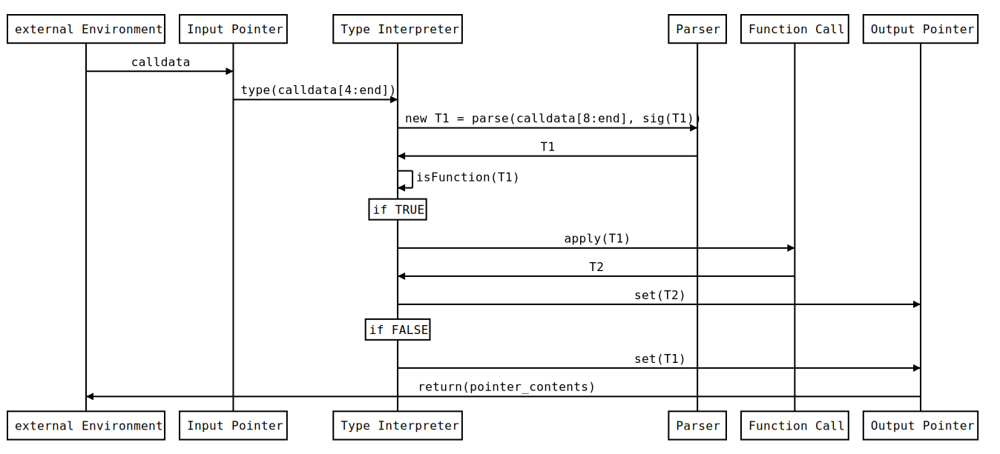

# From Stack Machine to Functional Machine: Step 1

###### tags: `Taylor`, `Ethereum`, `Solidity`, `Yul`, `eWasm`, `WebAssembly`

[ToC]

## Environment

For illustrating our journey, we will use the [Yul language](https://solidity.readthedocs.io/en/v0.6.4/yul.html) (that compiles to Ethereum 1.0 and Wasm bytecode).

## Anatomy of a Stack Runtime

```javascript

object "ContractA" {
    code {
        datacopy(0, dataoffset("Runtime"), datasize("Runtime"))
        return(0, datasize("Runtime"))
    }
    object "Runtime" {
        code {
            let _calldata := 256
            let _output_pointer := 0

            // Copy calldata at the _calldata pointer
            calldatacopy(_calldata, 0, calldatasize())

            // Read the first 4 bytes representing the signature of the called function
            // https://solidity.readthedocs.io/en/v0.6.4/abi-spec.html#function-selector
            let fn_sig := mslice(_calldata, 4)

            switch fn_sig
            case 0xffffffff {
                // do SOME COMPUTING
                let result := 10
                let result_length := 32
                mstore(_output_pointer, result)
                return(_output_pointer, result_length)
            }
            // other cases/function signatures
            default {
                // default case - revert with error code
                mslicestore(_output_pointer, 0xeee1, 2)
                revert(_output_pointer, 2)
            }

            function mslice(position, length) -> result {
                result := div(mload(position), exp(2, sub(256, mul(length, 8))))
            }

            function mslicestore(_ptr, val, length) {
                let slot := 32
                mstore(_ptr, shl(mul(sub(slot, length), 8), val))
            }
        }
    }
}
```

For any calldata that begins with the bytes `0xffffffff`, the above contract will perform <SOME COMPUTING>

We could assimilate this behavior with a function that has a signature and the output is a number of bytes. This function may have an input (the rest of `calldata` starting from byte 5 up to the end)

```
f(some_bytes) => some_other_bytes
```

If we have the ability to parse the bytes into some defined types, we could consider that a function is a transformation from a type into another.

```
parse(some_bytes) => T1
parse(some_other_bytes) => T2

f(T1) => T2
```

T1 and T2 could be any type. They could be even the same type or the `None` type or a `Tuple` of a number of types. Even more: we may define functions as being types as well: by using the function signature. For a complete solution on type definitions and casting, one may use dType: a fully decentralized type system. But we leave that subject for another day or [conference](https://solidity-summit.ethereum.org/).

## Functions as Types. Types as Functions.

We could treat functions as types. Even better: we should treat types as functions by choosing a representative function. Such a function is the `new` function: it accepts as input the minimum number of arguments for a type creation.
```
x1 := new(uint(8))
x2 := new(byte(32))
```
For such dependent types (that need to know the "parent" type and the size), we can define the dependent signature:

```
sig1 := signature(signature(uint), signature(8))
sig2 := signature(signature(byte), signature(32))
```
And for simplification, we could consider `signature(<number>) => <number>` and the signature function as `bytes4(keccak(<content>))`

### Calling a function from another function: `apply`

Let's define the `apply` function:

```
apply(T1) => T2
T1 = Tuple(signature(f), input)
T2 = f(input)

apply(signature(f), input) = f(input)
```

An example would be:

```javascript
object "ContractB" {
    code {
        datacopy(0, dataoffset("Runtime"), datasize("Runtime"))
        return(0, datasize("Runtime"))
    }
    object "Runtime" {
        code {
            let _calldata := 256
            let _output_pointer := 0

            calldatacopy(_calldata, 0, calldatasize())

            let fn_sig := mslice(_calldata, 4)

            switch fn_sig
            case 0xffffffff {
                let internal_fn_sig := mslice(add(_calldata, 4), 4)
                let input_pointer := add(_calldata, 8)

                let result_length := dtapply(
                    internal_fn_sig,
                    input_pointer,
                    _output_pointer
                )
                return (_output_pointer, result_length)
            }
            // other cases/function signatures
            default {
                mslicestore(_output_pointer, 0xeee1, 2)
                revert(_output_pointer, 2)
            }

            function dtapply(fsig, input, output_pointer) -> result_length {
                switch fsig
                case 0xeeeeeeee {
                    let a := mload(input)
                    mstore(output_pointer, add(a, 2))
                    result_length := 32
                }
                case 0xdddddddd {
                    let a := mload(input)
                    mstore(output_pointer, sub(a, 2))
                    result_length := 32
                }
                // other cases/function signatures
                default {
                    // default case - revert with error code
                    mslicestore(output_pointer, 0xeee2, 2)
                    revert(output_pointer, 2)
                }
            }

            function mslice(position, length) -> result {
                result := div(mload(position), exp(2, sub(256, mul(length, 8))))
            }

            function mslicestore(_ptr, val, length) {
                let slot := 32
                mstore(_ptr, shl(mul(sub(slot, length), 8), val))
            }
        }
    }
}

```

Using `0xffffffffeeeeeeee000000000000000000000000000000000000000000000000000000000000000a` as calldata, we get `12`. `0xffffffff` applied `0xeeeeeeee` on the input arguments, in this case the value `10`.

Using `0xffffffffdddddddd000000000000000000000000000000000000000000000000000000000000000a` as calldata, we get `8`.

#### Functional interaction for `apply`

```sequence
external Environment->Input Pointer:calldata
Input Pointer->Type Interpreter:type(calldata[4:end])
Type Interpreter->Parser:new T1 = parse(calldata[8:end], sig(T1))
Parser->Type Interpreter:T1
Type Interpreter->Type Interpreter:isFunction(T1)
note over Type Interpreter:if TRUE
Type Interpreter->Function Call:apply(T1)
Function Call->Type Interpreter:T2
Type Interpreter->Output Pointer:set(T2)
note over Type Interpreter:if FALSE
Type Interpreter->Output Pointer:set(T1)
Output Pointer->external Environment:return(pointer_contents)
```



In the above case, each function extracts the arguments that it expects, but this can become verbose and prone to errors.

We already have a type parser that is generated by on-chain type definitions by dType. Also we have a Type Interpreter and Function Caller: it is the Pipeline intra-contract on-chain interpreter. More on this, in the next articles.

## Recursive `apply`

```javascript
object "ContractB" {
    code {
        datacopy(0, dataoffset("Runtime"), datasize("Runtime"))
        return(0, datasize("Runtime"))
    }
    object "Runtime" {
        code {
            let _calldata := 256
            let _output_pointer := 0

            calldatacopy(_calldata, 0, calldatasize())

            let fn_sig := mslice(_calldata, 4)

            switch fn_sig
            case 0xffffffff {
                let internal_fn_sig := mslice(add(_calldata, 4), 4)
                let input_pointer := add(_calldata, 8)

                let result_length := dtapplyRecursive(
                    internal_fn_sig,
                    input_pointer,
                    _output_pointer
                )
                return (_output_pointer, result_length)
            }
            // other cases/function signatures
            default {
                mslicestore(_output_pointer, 0xeee1, 2)
                revert(_output_pointer, 2)
            }

            function dtapplyRecursive(fsig, input, output_pointer) -> result_length {
                switch fsig
                case 0xeeeeeeee {
                    let a := mload(input)
                    mstore(output_pointer, add(a, 2))
                    result_length := 32
                }
                case 0xdddddddd {
                    let a := mload(input)
                    mstore(output_pointer, sub(a, 2))
                    result_length := 32
                }
                case 0xcccccccc {
                    let internal_fsig := mslice(input, 4)
                    // skip the 4 byte signature & the 32 byte value
                    let count := mslice(add(input, 36), 4)

                    let temporary_ptr := add(input, 4)

                    for { let i := 0 } lt(i, count) { i := add(i, 1) } {
                        result_length := dtapplyRecursive(internal_fsig, temporary_ptr, output_pointer)
                        temporary_ptr := output_pointer
                    }
                }
                // other cases/function signatures
                default {
                    // default case - revert with error code
                    mslicestore(output_pointer, 0xeee2, 2)
                    revert(output_pointer, 2)
                }
            }

            function mslice(position, length) -> result {
                result := div(mload(position), exp(2, sub(256, mul(length, 8))))
            }

            function mslicestore(_ptr, val, length) {
                let slot := 32
                mstore(_ptr, shl(mul(sub(slot, length), 8), val))
            }
        }
    }
}
```

Using `0xffffffffcccccccceeeeeeee000000000000000000000000000000000000000000000000000000000000002800000004` as calldata, we instruct the `0xcccccccc` function to apply the `0xeeeeeeee` function on the value `40`, `4` times. This means `40 + 2 * 4`. We get `48`.

Using `0xffffffffccccccccdddddddd000000000000000000000000000000000000000000000000000000000000002800000004` as calldata, we get `32`: `40 - 2 * 4`.


## Function Persistence

We could save any type/function on-chain (for the EVM) or into a JSON file treated by Javascript (for Wasm ).
A persisted function is a combination of other functions in a recursive manner until the "leaf" functions are applied. The "leaf" functions are contained in the smart contract iself or in other (external) smart contracts or Wasm libraries (in the Wasm case).
Such a system of editing and deploying functional combinations is already implemented by the Pipeline Editor.

## Implementation

The ideas above and the steps that will be described in future articles are even better implemented in the Taylor project. Taylor is an interpreted functional language with typing described by dType.

## Next: Step 2

**Recursive application is the "engine" of functional programming.** In the next step, we will show applications of this engine.

In the next article: Some functional patterns implemented in the same environment.
