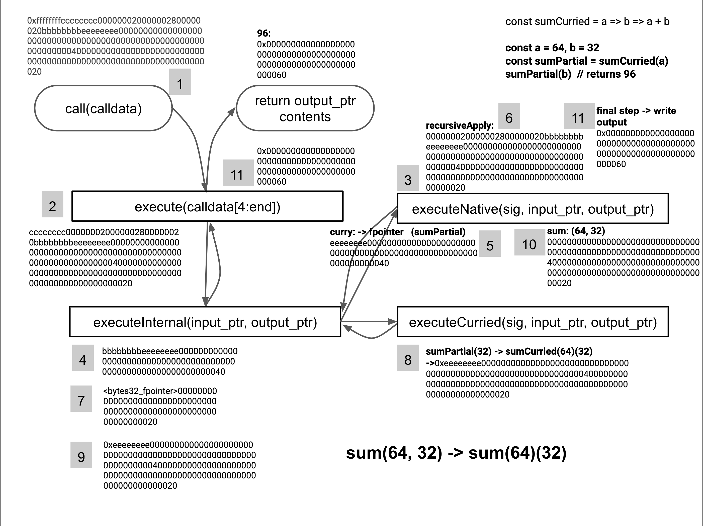

# From Stack Machine to Functional Machine: Step 2 - Currying

###### tags: `Taylor`, `Ethereum`, `Solidity`, `Yul`, `eWasm`, `WebAssembly`

This is a gradual introduction to my talk at the [Solidity Summit](https://solidity-summit.ethereum.org), Wednesday, 29th of April at 2:50:00 PM CEST. [Agenda](https://docs.google.com/spreadsheets/d/1ylkaTYKx9TbAifCgyH2jN9SKJKrYfzab9zzTZgSL44g/edit#gid=0).

[ToC]

## Environment

For illustrating our journey, we will use the [Yul language](https://solidity.readthedocs.io/en/v0.6.4/yul.html) (that compiles to Ethereum 1.0 and Wasm bytecode).

If you want to run the examples, it can be done with https://remix.ethereum.org:
- choose Yul as the compiled language, use the raw `calldata` input, check the return value using the debugger.
- use the Yul+ plugin to compile, deploy and interact (you will need to comment out the `mslice` helper function)

The code example below can also be found at https://gist.github.com/loredanacirstea/1aa18e33342b862d8dc76c01b12b7dbc.

## Prerequisites

Read the previous article [From Stack Machine to Functional Machine: Step 1 (recursive apply)](https://medium.com/@loredana.cirstea/from-stack-machine-to-functional-machine-step-1-fd2f12a372e2).


## Currying

Currying is the technique of breaking down a function that takes multiple arguments into a series of functions, each taking one or more of those arguments.

Therefore, we can write `const sum = (a, b) => a + b` as:

```
const sumCurried = a => b => a + b

const sumPartial = sumCurried(64)
sumPartial(32)  // returns 96
```

And now we can reuse `sumPartial` in other places in our code, for example, as an argument to a `map` function: `map(array, sumPartial)`.

In our on-chain interpreted type system Taylor, with currying, we can define classes of types. `uint` itself is a partially applied function and now we can reuse this function as `uint(256)` and we will get a concrete type.

### Elastic Arity

Currying and de-currying are important tools to achieve better human-computer communication.

If the human is used to a sum function of arity 2: `sum(a, b)`, by currying, the computer will interpret it as a composition of functions with arity 1: `sum(a)(b)`

If there is a family of functions of arity n, a covering function of arity n+1 can be constructed such that any one of the initial functions are called by means of an additional argument that does the selection.
Having the arity dynamic may make the function much more intuitive:
```
sum[arity n+1] = sum[arity n](last_argument)

sum(2,3,4,5) = sum(2,3,4)(5) = ... = sum(2)(3)(4)(5)
```

### Currying in the Ethereum Virtual Machine and WASM

Yul allows us to work directly with the stack and memory, so we have enough freedom to implement a currying system at runtime.

All that we need to do is maintain a space in memory, where our curried functions reside. In the following code, we will treat each memory pointer to a curried function as the curried function's signature.

At the memory pointer, we will find the signature of the underlying function, along with the partially-applied arguments. In our above example, this would mean `<sumCurried_signature>0000000000000000000000000000000000000000000000000000000000000040` (`64 = 0x40`).

Now, we can use the curried function's signature in other functions and we are going to build upon the `recursive apply` code presented in our **[Step 1](https://medium.com/@loredana.cirstea/from-stack-machine-to-functional-machine-step-1-fd2f12a372e2)** article.


The following code allows us to recursively apply a series of functions, where the output of each function is fed to the next function, as input.

We have:
- some "native" functions in `executeNative`, such as `sum` (`0xeeeeeeee`), `recursiveApply`(`0xcccccccc`) and `curry` (`0xbbbbbbbb`). And we will call `recursiveApply` with a number of `steps`, each step is a function that has some inputs.
- `executeCurriedFunction`, which knows how to process curried functions
- `executeInternal`, which knows how to distinguish a "native" from a curried function.

#### Currying Example: sum(64, 32)

The `calldata` will be: `0xffffffffcccccccc000000020000002800000020bbbbbbbbeeeeeeee00000000000000000000000000000000000000000000000000000000000000400000000000000000000000000000000000000000000000000000000000000020`

```
ffffffff  - the main execute function
cccccccc  - recursiveApply
00000002  - number of steps for recursiveApply
00000028  - data length in bytes for the first step
00000020  - data length in bytes for the second step
bbbbbbbb  - second step starts here, with the signature for the curry function
eeeeeeee  - sum function signature
0000000000000000000000000000000000000000000000000000000000000040
    - partially applied argument for sum: 64
0000000000000000000000000000000000000000000000000000000000000020
    - second step, with the second sum argument: 32
```

#### Program Flow




**Start call**
- the `execute` function calls `recursiveApply` with `000000020000002800000020bbbbbbbbeeeeeeee00000000000000000000000000000000000000000000000000000000000000400000000000000000000000000000000000000000000000000000000000000020`
- `recursiveApply` breaks down the steps and runs each of them, feeding the output of each step into the next one

**Step 1**
- `recursiveApply` calls `executeInternal` with `bbbbbbbbeeeeeeee0000000000000000000000000000000000000000000000000000000000000040`
- `executeInternal` sees that the signature is 4 bytes and calls `executeNative`, forwarding all data
- `executeNative` unpacks the `0xbbbbbbbb` signature and the program reaches the `curry` function.
- `curry` stores the virtual, curried function signature `0xeeeeeeee` and the partially applied argument `0x0000000000000000000000000000000000000000000000000000000000000040` (`64`) at a memory pointer and writes that pointer into the `output_ptr`
- the program returns to `recursiveApply`, which prepares the output as input for the next step

**Step2**
- `recursiveApply` calls `executeInternal` with `<sumPartial_pointer>0000000000000000000000000000000000000000000000000000000000000020`
- `executeInternal` sees that the signature is 32 bytes and calls `executeCurried`, forwarding all data
- `executeCurried` calls `executeInternal` with `0xeeeeeeee0000000000000000000000000000000000000000000000000000000000000040000000000000000000000000000000000000000000000000000000000000020`, merging the curried function data with the new input
- `executeInternal` sees that the signature is 4 bytes and calls `executeNative`
- `executeNative` unpacks the `0xeeeeeeee` signature and the program reaches the `sum` function
- `sum` adds the two arguments and writes the answer in the `output_ptr` memory pointer.
- the program returns to `recursiveApply` and `output_ptr` points at the result

**Return**
- the program returns to `execute` and the result from `output_ptr` is returned


```javascript
object "ContractB" {
    code {
        datacopy(0, dataoffset("Runtime"), datasize("Runtime"))
        return(0, datasize("Runtime"))
    }
    object "Runtime" {
        code {
            let _calldata := 2048
            let _output_pointer := 0

            // This is where we keep our virtual functions
            // generated at runtime as partial function applications
            let _virtual_fns := 1024

            calldatacopy(_calldata, 0, calldatasize())

            let fn_sig := mslice(_calldata, 4)

            switch fn_sig

            // execute function
            case 0xffffffff {
                let internal_fn_sig := mslice(add(_calldata, 4), 4)
                let input_pointer := add(_calldata, 8)
                let input_size := sub(calldatasize(), 4)

                let result_length := executeNative(
                    internal_fn_sig,
                    input_pointer,
                    input_size,
                    _output_pointer,
                    _virtual_fns
                )
                return (_output_pointer, result_length)
            }
            // other cases/function signatures
            default {
                mslicestore(_output_pointer, 0xeee1, 2)
                revert(_output_pointer, 2)
            }

            function executeNative(
                fsig,
                input_ptr,
                input_size,
                output_ptr,
                virtual_fns
            ) -> result_length {
                switch fsig

                // sum: a + b
                case 0xeeeeeeee {
                    let a := mload(input_ptr)
                    let b := mload(add(input_ptr, 32))
                    mstore(output_ptr, add(a, b))
                    result_length := 32
                }

                // recursiveApply
                case 0xcccccccc {
                    // e.g. 2 steps:
                    // 000000020000002800000020
                    // bbbbbbbbeeeeeeee000000000000000000000000000000000000000000000000000000000000004
                    // 00000000000000000000000000000000000000000000000000000000000000020

                    // number of execution steps
                    let count := mslice(input_ptr, 4)

                    // offsets/size in bytes for each step
                    let offsets_start := add(input_ptr, 4)
                    let input_inner := add(offsets_start, mul(count, 4))

                    let temporary_ptr := 0x80
                    let existent_input_size := 0

                    for { let i := 0 } lt(i, count) { i := add(i, 1) } {
                        let step_length := mslice(add(offsets_start, mul(i, 4)), 4)

                        // add current input after previous return value
                        mmultistore(
                            add(temporary_ptr, existent_input_size),
                            input_inner,
                            step_length
                        )

                        result_length := executeInternal(
                            temporary_ptr,
                            add(existent_input_size, step_length),
                            output_ptr,
                            virtual_fns
                        )

                        // move termporary input after previous data
                        temporary_ptr := add(temporary_ptr, step_length)

                        // store output as new input for the next step
                        mmultistore(temporary_ptr, output_ptr, result_length)
                        existent_input_size := result_length

                        // move input pointer to the next step
                        input_inner := add(input_inner, step_length)
                    }
                }

                // curry: fsig, partial application argument
                case 0xbbbbbbbb {
                    // first 32 bytes is the next free memory pointer
                    let fpointer := mload(virtual_fns)
                    if eq(fpointer, 0) {
                        fpointer := add(virtual_fns, 32)
                    }

                    let internal_fsig := mslice(input_ptr, 4)
                    let arg := mload(add(input_ptr, 4))

                    // virtual function marker
                    mslicestore(fpointer, 0xfefe, 2)

                    // add input size (so we know how much to read)
                    mstore(add(fpointer, 2), input_size)

                    // store the actual data - partial application argument
                    mmultistore(add(fpointer, 34), input_ptr, input_size)

                    // update the free memory pointer for our curried functions references
                    mstore(virtual_fns, add(fpointer, 38))

                    // return the virtual function pointer
                    mstore(output_ptr, fpointer)
                    result_length := 32
                }
                // other cases/function signatures
                default {
                    // revert with error code
                    mslicestore(output_ptr, 0xeee2, 2)
                    revert(output_ptr, 2)
                }
            }

            function executeInternal(
                input_ptr,
                input_size,
                output_ptr,
                virtual_fns
            ) -> result_length {
                let fsig, offset := getfSig(input_ptr)

                switch offset
                case 4 {
                    result_length := executeNative(
                        fsig,
                        add(input_ptr, offset),
                        sub(input_size, offset),
                        output_ptr,
                        virtual_fns
                    )
                }
                case 32 {
                    result_length := executeCurriedFunction(
                        fsig,
                        add(input_ptr, offset),
                        sub(input_size, offset),
                        output_ptr,
                        virtual_fns
                    )
                }
                default {
                    // revert with error code
                    mslicestore(output_ptr, 0xeee3, 2)
                    revert(output_ptr, 2)
                }
            }

            function getfSig(input_ptr) -> fsig, offset {
                fsig := mslice(input_ptr, 4)
                offset := 4
                let fpointer := mload(input_ptr)

                if lt(fpointer, 10000000) {
                    // check if the curried function marker exists
                    if eq(mslice(fpointer, 2), 0xfefe) {
                        fsig := fpointer
                        offset := 32
                    }
                }
            }

            function executeCurriedFunction(
                fpointer,
                input_ptr,
                input_size,
                output_ptr,
                virtual_fns
            ) -> result_length {
                // first 32 bytes are the input size
                let new_input_size := mload(add(fpointer, 2))

                // exclude input size from input ptr
                let new_input_ptr := add(fpointer, 34)

                // store the inputs for the curried function after the curried function arguments
                // effectively composing the input for the actual function that we need to run
                mmultistore(add(new_input_ptr, new_input_size), input_ptr, input_size)
                new_input_size := add(new_input_size, input_size)

                result_length := executeInternal(
                    new_input_ptr,
                    new_input_size,
                    output_ptr,
                    virtual_fns
                )
            }

            function mslice(position, length) -> result {
                result := div(
                    mload(position),
                    exp(2, sub(256, mul(length, 8)))
                )
            }

            function mslicestore(_ptr, val, length) {
                let slot := 32
                mstore(_ptr, shl(mul(sub(slot, length), 8), val))
            }

            function mmultistore(_ptr_target, _ptr_source, sizeBytes) {
                let slot := 32
                let size := div(sizeBytes, slot)

                for { let i := 0 } lt(i, size)  { i := add(i, 1) } {
                    mstore(
                        add(_ptr_target, mul(i, slot)),
                        mload(add(_ptr_source, mul(i, slot)))
                    )
                }

                let current_length :=  mul(size, slot)
                let remaining := sub(sizeBytes, current_length)
                if gt(remaining, 0) {
                    mslicestore(
                        add(_ptr_target, current_length),
                        mslice(add(_ptr_source, current_length), remaining),
                        remaining
                    )
                }
            }
        }
    }
}
```

Having a technique for currying functions (at runtime) is the second step in turning a stack machine into a functional machine.

Partially applied functions can be very important when used as a `map` or `reduce` argument, allowing you to write extensible code.

## Next: Step 3

In the next step, we will show you how higher-order functions can be used in this recursive engine.
