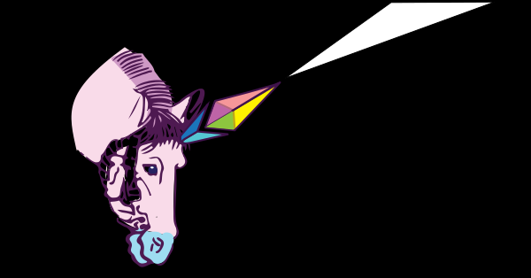

# The Ethereum Unicorn

## A Unicorn?

A Unicorn is a mythical ethereal creature - fed with the dreams and ideals of people. It is one of the few such myths that became decentralized, **common to many cultures**.

Let’s take off from **Renaissance Europe**, where the Unicorn is a symbol of purity and grace, a horse/goat-like animal with a white body and a long, unique horn, lion tail and either split or unsplit hooves, goat beard or no beard. Then, we arrive to read **ancient Greek** writings of natural history, where it was believed that unicorns exist in **India**, being the size of a horse, with a white body, purple head, blue eyes, having a horn colored in white, red and black. We fly to the **medieval era**, where it was associated allegorically with Christ, being tamed only by the pure-hearted Virgin Mary. Then in the humanist era, becoming a symbol of chastity and marriage.

Let's fly to **Russian** folklore, where we find **Indrik Индрик-зверь**, the king of all animals, living in "The Holy Mountain", where no humans can set foot - a gigantic bull with deer legs, horse head and an enormous horn on his nose.

From here, we jump to **China**, where the **qilin 麒麟** has scales, resembling a dragon, a lion head, an ox’s tail, an antler horn instead of a one-pointed horn, and sometimes even wings. Often, it is a mix of bodies, a **chimera**. It appears with the imminent arrival or passing of a great sage or illustrious ruler. The **Japanese** version is similar, but the **kirin キリン** has a more deer-like appearance. Due to their gentle nature, the kirin’s attributes have been associated with giraffes and they share the name. **They are heralds of a golden age that is just beginning** and they are the **most powerful creatures** — more powerful than the dragon or the phoenix.

We have to also visit the **Islamic** world, where we find the **buraq** — a noble horse, with the head of a human and wings of an eagle, capable of flying at the speed of lightning, being a vehicle for prophets, including Muhammad. Though it has no horn, its symbolism is very close to Chinese version: it is the bringer of one prophet, one sage, one teaching, for the coming of the new age. The teaching represents the horn in this instance.

Each culture has its own custom version of the myth. It has been depicted according to the cultural milieu. But despite this, it has maintained a **common core of objective universal values**. These are **Truth, Beauty, Goodness**. Or, after the Japanese traditional teachings: **Truth(真, shin), Beauty (美, bi), Virtue (善, zen)**.

The Unicorn’s only horn is a representation of **Truth** — there is a central righteous way and the focus is unwavering. The legends have it with a white body, symbolizing purity. The Unicorn can purify water with its horn and heal sickness — a symbol of the power to clean up muddiness and bring transparency. In the perpetual conflict with evil, truth and righteousness need weapons and strength. The Unicorn can have an unusually powerful physical strength — it can kill an elephant, it can defeat a lion. Its horn is its weapon and it can be used against those who do not share the true values.

It is frequently depicted as the most **beautiful** and elegant animal. The various attributes (purple head, lion tail, wings) are markers of rarity and wonder. Its beauty also lies in the diversity of representations.

The Unicorn has been used as a symbol of Christ in medieval ages and in Chinese & Japanese cultures it is said to have a vegetarian and quiet nature, being able to walk on grass without disturbing it. These are characteristics of **Goodness** or **Virtue**. The horn is spiraled — the strive for perfection, the spiral that adapts its trajectory until it reaches the only correct direction. It is also a sign of intellectual vitality — the phallic symbol. Not only intellectual creativity but depth — the screw penetrates through the dullness of mind. It is dynamic, work performing energy.

But the Unicorn symbol has two parts. An **apparent** part, that is very distinct, outstandingly visual to everyone. And an **occult** part, available only to the initiated, who consider the Unicorn a muse. It has been often shown as having a free, unruly and combative nature, that can only be tamed and understood by a pure heart.

### What is the Essence of The Unicorn?

- truth, through the power of clarification, intellectual vitality and strength
- continuous strive for perfection
- unusualness in appearance
- common objective values represented by various cultural depictions
- anyone can be inspired by it or add to the lore, but only those initiated understand its nature
- always free and cannot be tamed by ill intent

## The Ethereum Unicorn

Aside from the short-term money gambling and scammy ICOs that have both plagued the spirit of Ethereum and made Ethereum viral (anyone is free to use it as they want - great!), there is an idealistic part of Ethereum.

Ethereum wants to bring **decentralization** and diversity into the world. **Diversity** of approach, diversity of implementation, diversity of knowledge. A new meaning to "divide and conquer".

Ethereum wants to bring **Truth** into the world. Transparency, fact checking, accountability, trustlessness by immutability of agreements.

Ethereum strives to foster **equality of opportunity**: payment systems for the unbanked, UBI for impoverished people, global bounty systems for earning resources.

Ethereum wants to be a tool for **righteousness** - smart contract based legal contracts and systems, programmatic dispute resolution, proof of stake (!).

Ethereum incentivizes **collaboration** throughout the world. Governance models and contracts, open participation in Ethereum's well being - governance through EIPs (and other proposals), open source and open discussions.

Ethereum wants to bring **happiness** into the world. The greatest happiness that one can have is when one builds, shapes and contributes to a community that shares one's values. It gives you wings, it makes you dance on stage, it makes you sing, without caring what external people think. Because you know your community shares your values and understands your reasons.

**Ethereum has positioned itself as The Unicorn.**

Ethereum, as a community, is a **vehicle** for each member, such as the Unicorn (horse) is understood as a vehicle. Smart contracts themselves are vehicles (means) for human trustless interactions.

Ethereum has an **apparent** part, which is available everywhere, it is unusual in its aesthetics, in its portrayed ideals, in its culture as a whole. But Ethereum also has an **occult** part: only those initiated in the protocol knowledge and smart contract languages can understand it and build it, for others to benefit and be inspired.

Ethereum strives for attaining the same objective universal values that The Unicorn represents. **Truth** is part of Ethereum’s essence, through transparency and trustlessness. **Goodness** and **Virtue** are part of its essence — Ethereum is a truly novel idea, that empowers people, gives them tools against corrupt governments, gives them a voice in governance. And Ethereum is **beautiful** — from the beauty of the tech that it is being built, to the beauty of the spirit that can stand behind its community.

## What Does The Ethereum Unicorn Eat?

The Unicorn consumes all of the values that were mentioned above:
- truth / transparency
- decentralization / diversity
- striving for perfection
- equality of opportunity
- righteousness
- open collaboration
- happiness / freedom of expression (*)

(*) *But The Unicorn's happiness depends on all the others being met. When you expect them to be met and they are not, freedom of expression leads to unhappiness.*

## What Does The Unicorn Produce?

The **Uni**corn has an unwavering focus. Into **one** point.

Think of The Unicorn as a giant multifaceted diamond, with light coming in from all sides. A spectacle of rainbows inside, bouncing back and forth, joining forces or splitting up. But all of these rainbow rays eventually power up themselves and blast through the one tip. Producing light.

**This is the Singleton Computer that Ethereum could be.**

## So What is The Spirit of Ethereum?

In the Japanese tradition, everything has a spirit, a **kami 神**.

**Could The Unicorn be the kami of Ethereum?**

Are we ready to accept such a power spirit? If we are ready, are we and can we become a worthy steward, to keep The Unicorn alive and well?

**Let’s work together, don’t let the Unicorn die.**
