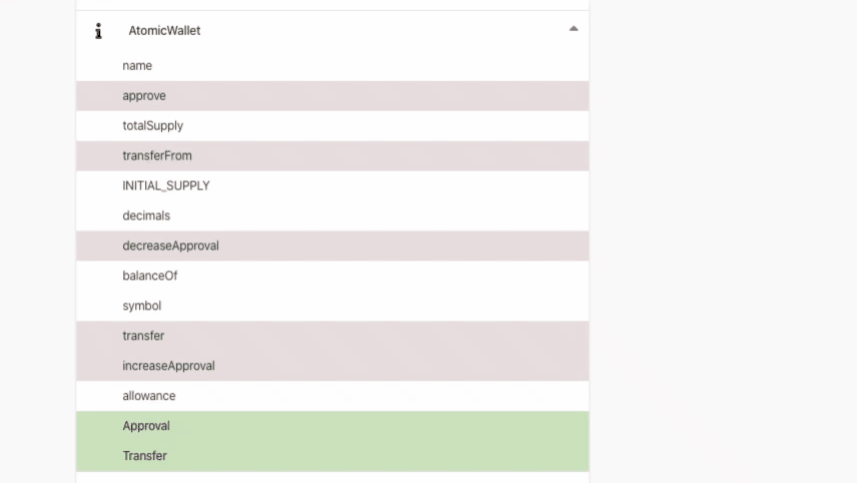

# A Future Thing: The Global App

Imagine a space where you can freely explore a dataset along several spatial indexes (like aisles).
One such example with two spatial indexes could be seen in Matrix:

https://youtu.be/5oZi-wYarDs

Imagine a world where you can select and collect items into your workspace. Such items will come with their own behavior and managing tools and manuals.
One imperfect example comes also from Matrix:

https://youtu.be/6AOpomu9V6Q

Ideally, here, any observable object should automatically give access to a toolset and manual. Trinity shouldn’t have needed to request the manual.

Imagine the power to contribute to any object of that world with functionality extension, update in performance for old functions, and new types of sub-objects.
You are the Constructor of the Construct.

## Definition and Use

Yes: the Global App as a concept would make several upgrades to the concept of Construct from Matrix. But the Construct already qualifies as Global App (for Virtual Reality).

Today we use some software that almost qualifies: any modern Operating System, the Internet + the browser + a densely-connected site such as Wikipedia or Google, or Minecraft.

Any globally used software that **takes data as input and presents the user with functionality and tools specific for that type of data** is close to what we call a Global App in this article. **It is an IDE and an application at the same time** — similar to Minecraft.

The most important characteristic is the multitude of functions presented for each data type or/and a multitude of data types. For example, our Remix Pipeline plugin handles right now ~100 data types, 120,558 smart contract functions from 8,172 smart contract instances. This number is quite small compared to what Global Apps would need.

Global Apps need to be **decentralized** and **distributed** to the majority of users. Data types, source code and the data itself need to be stored in a decentralized and distributed way.

What we get is a **global**, **deterministic** app, which always has the same properties if the same data types are used. For anyone. **What I have access to see is what you have access to see.**

A Global App is **built on-demand, based on the data that you, the user, is working on**. The system sees the types and knows what functions, modules and dependencies it needs, in order to create the virtual world of possible use cases. And it retrieves these functions, modules, and dependencies from the global storage. Be them WASM modules, blockchain smart contracts or other types of runtime and data.

For every purpose, **a Global App is one for all**. Every human has access to the exact type of instance — not a Singleton, but the exact same runtime.
And there can be an exponentially increasing number of Global Apps. Because they are not put together manually. They are created on-the-fly when you want to use them.

Think of it like going to a bike shop that has access to any type of bike part ever used and telling the shop assistant exactly what type of terrain you want to ride on, how long is the ride, how long you want your bike to last and your body measurements. The assistant will present you with a list of general options/categories of bikes that might fit. You choose. The assistant builds the bike on the spot based on what individual parts fit the requirements. The behavior is deterministic: if you have a twin who will ride along your side and has your exact body measurements, that twin will get an exact replica of your bike.

A Global App is enriched when developers add more functionality for one or more of the data types used by it — **one change is spread across the network** and every user benefits. **Developers working on a single function would effectively contribute to any Global App that ends up using that function.**

In terms of economic sustainability and open source market fairness, **each developer of functionality should be able to set a price per instance of function use and accumulate a profit in the most direct and meritocratic manner.**

## Anatomy

So, how would a Global App’s components look like, with the tools we have today?

### A Context of Typed Data

We start with a data context. For Google Search or Wikipedia, this is a `String`. For Minecraft, this is the initial game stage or the selected object. For the above bike shop, the data context is the terrain data, bike lifetime data, body measurements.

It can be your DNA data, neatly typed and labeled or Earth’s geographical data. **The software retrieves a list of all the things that you can do with this data** — from analysis tools to visualizations or simulations. You can choose what route to take and, as a consequence, a Global App is created for you: everything is loaded on-demand — from source code to additional public data, from the global storage. The behavior is deterministic: anyone else with the same types of data (quality not quantity) will see what you see.

The main characteristic of a Global App is its **lack of limits**. If you keep going deeper into the app, you will get to see more and more tools and data types related to your current data. And get notified when something new appears in the public data system.

Of course, you can also use your own private data on top. And decide if you want to share anything with the world or not.

### The List of Types

You have your context of typed and structured data. **The system finds all the types and subtypes from its composition, prioritizing by depth level.**

You might decide that you want to treat this data or part of it as input to be processed or you might decide that you need more data of this type and therefore, treat the types as output types.

With this information, the system proceeds to the next step.

### The List of Functions with Types as Input/Output

The system will retrieve the list of actions that you can take, translated as **high-level functions and subfunctions with matching input/output types**. It will query the global, distributed database and retrieve the list based on the interface descriptions of these functions.

You will be presented with this list in a human-friendly way.

In concept, this is similar to how you can search for graph nodes by input and output types, in our last [alpha version of Pipeline](https://observablehq.com/@loredanacirstea/pipeos-web3-env) (visual IDE for creating executable graphs by connecting functions’ inputs and outputs):

https://youtu.be/PGAvFef7-wc

And remember Trinity and the helicopter? **The manual/minimal documentation has to be offered automatically by the app.**

As an example, Ethereum smart contracts developers can use Natspec to provide human-readable descriptions:

### A Menu

You will be presented with a menu.

Maybe the types of UI menus that we are using today or maybe a Virtual Reality menu where you can interact with the options and visualize them as graphs or expressive objects with previews of what their function is.
You choose your next step from the menu.

### A Loader of Libraries

When you decide the action, the system will retrieve all the modules, dependencies and ultimately functions, needed to create your work environment.

**They will be dynamically loaded at runtime and unloaded when you finish and do not need them anymore.**

### A Data Input/Output Control

Now, you are ready to process the data.
You are presented with the **action’s workflow**. Maybe you want/need to split that data or to work on the lower nested levels and subtypes.

**You will need a structured way to control and see the data in the workflow.** Maybe stop the workflow at different points, see intermediary results and then restart or change the workflow.

A simple example would be typed control UI, where you have access to the underlying data and can apply transformations on it.

Another example might be a visualization of that geographical data, changing based on a simulation algorithm, that you can pause, change the parameters (through another typed control) and then resume.

### A Work Environment

Your work environment also contains processing **results and intermediary results**. They are the inputs and outputs of the various functions that your data passed through.

You can choose to save those results and make them public or keep this state private, in your profile, under your identity.

This environment is a pipeline of processes that will be fully automated once you set your rules.

## Realization

Today, the Global App runtime can be based on **WASM** modules, **FFI** dynamic loading, **blockchain smart contracts** and a **“glue”** that enables interoperation. The easiest “glue” is **JavaScript** — WASM integration comes right out of the box and runs on both client and server.

Developers can create safe and deterministic modules using languages that compile to WASM (Rust, C/C++, AssemblyScript, etc.), **exporting their interface descriptions based on the same type system standard**. Global Apps could run in your browser or have parts that run on your OS.

### With WASM and JS

[WebAssembly](https://webassembly.org/) is designed as a portable target for compilation of high-level languages like C/C++/Rust, enabling deployment on the web for client and server applications. It describes a memory-safe, sandboxed execution environment that may even be implemented inside existing JavaScript virtual machines.

WASM execution aspires to be [as deterministic as possible](https://webassembly.org/docs/nondeterminism/), on all platforms.

All of the above makes WASM a good candidate for a Global App, which can effectively be viewed as a **global plugin system**. We have written in the past about the concept of **[plugems](https://medium.com/@loredana.cirstea/plugems-next-gen-dapps-for-the-world-computer-451b93fd82cf)**, which are independent plugins that are able to cooperate with one another without having a Plugin Manager to control them. But more details about this topic, in the context of a Global app, will be given at a later time.

A demo of how JavaScript can interact with WASM instances and provide the glue for chaining various WASM functions can be seen here: https://youtu.be/tkbo-cnlCKk?t=51

### With Blockchain and JS

Our [Pipeline](https://github.com/pipeos-one/pipeline) and [dType](https://github.com/pipeos-one/dType) projects started on the Ethereum network. We wanted to bring **common types and a graphical language to build interoperable logic on the smart contract-based protocols**, in the browser.

Blockchains have had enough exposure to bring the concepts of decentralization and immutability to a larger audience, not only to developers but to non-technical people.

Blockchain protocols can be integrated into a Global App workflow by providing additional layers for things such as payments, validation proofs, trustless computation, etc.

### With Dynamic Libs (FFI) and JS

JavaScript can dynamically load and use external binaries (e.g. WASM, Rust, C/C++) using FFI, acting like **a glue that can also provide type checking at runtime, based on the interface descriptions exported by the binaries themselves.**

A PoC of executing Pipeline graphs containing WASM library functions, from Node.js, can be found here: https://youtu.be/mn1fPEQE3k0

A PoC of executing Pipeline graphs containing Rust library functions, from Node.js, through [Neon bindings](https://github.com/neon-bindings/neon), can be found here: https://youtu.be/NDFpgfZY2Ic (Neon for FFI Rust -> Node.js).

## Present Tech That Leads There

**For a constellation of Global Apps to exist, we need to have a standardized way to describe types and function interfaces.**

This is what we had in mind when we started dType. You can see our demos [here](https://www.youtube.com/playlist?list=PL323JufuD9JC46yClCf5fdaEX17kocem7).

### [dType](https://github.com/pipeos-one/dType)

Typing systems are undoubtedly powerful, but they have mostly been used to structure the ecosystem of a single project or, at most, of multiple projects within the same company. Now, if we pass data through multiple systems, developed independently, we need to add data type adaptors and make sure the external systems do not change their data types on the fly and crash our system.

This approach is not scalable. **When we have an immutable global type system, we can be sure that no one pulls the rug under our feet.**

Exposing function interfaces at runtime is crucial for dynamic type checking of data passed module<->module or module<->glue. Interfaces are also important for programmatically building UI controls or workflow tools, such as Pipeline.

This is how [`dtypei`](https://github.com/pipeos-one/dtypei) was born, for Rust and WASM.

Rust and WASM do not keep type information. And the current [wasm-bindgen](https://github.com/rustwasm/wasm-bindgen) JavaScript bindings downcast more strict types, such as `i16` to a plain `Number`.

**`dtypei` helps Rust developers to annotate their exports and to make the interface descriptions available at runtime.** You can use the alpha version of the two crates: https://crates.io/crates/dtypei, https://crates.io/crates/dtypei-derive.

Demos of how `dtypei` works:
- Bridging Types — Rust/Wasm Exports Introspection: https://youtu.be/3lCnO9sI548
- Rust/Wasm Exports Introspection v.0.0.1: https://youtu.be/tkbo-cnlCKk

### [Pipeline](https://github.com/pipeos-one/pipeline)

Pipeline was started as a tool to interoperate between protocols, on Ethereum. But the same principles apply to other types of computation substrates. As you can see in the above videos, it can be used to run WASM or Rust binaries.

You can see our demos [here](https://www.youtube.com/playlist?list=PL323JufuD9JAyaYCEvrnQ5yOAc3ukuNyF).

## You, Now

We have built these proofs of concept and tools as open-source volunteers because we think that the future is decentralized, collaborative and interoperable.

If you share the vision that we presented, you can:

- use the `dtypei` crates to compile your wasm lib and your lib will become part of the first Global App PoC
- make Pipeline graphs for WASM or Ethereum
- use `dtype` to define new types and propose them to the `dtype` team
- understand well the concept of Global App and share your understanding with other developers and visionaries.

**Imagine together the first version of a fully-fledged Global App making soon Computing History.**

Made in collaboration with my partner, `ctzurcanu`.
